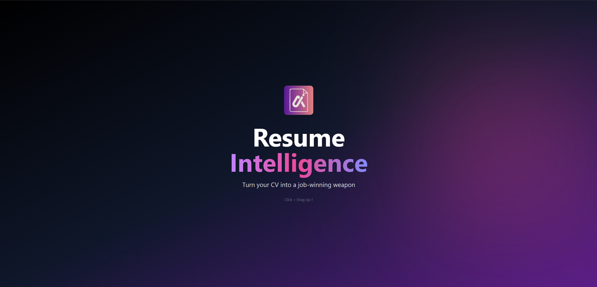
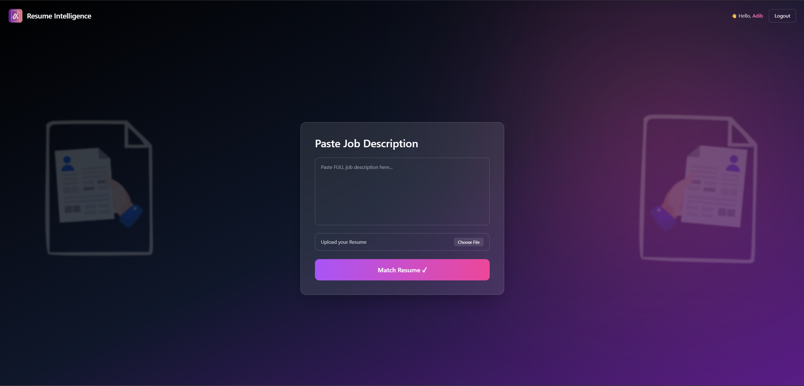
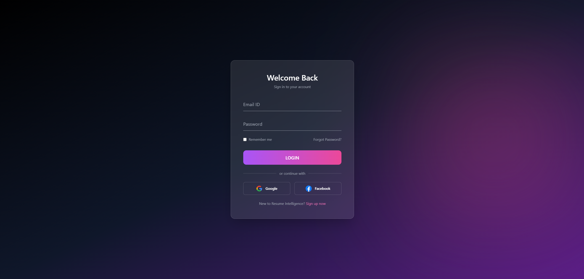
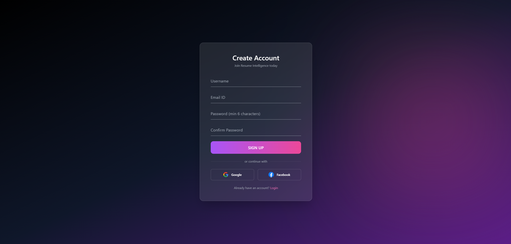
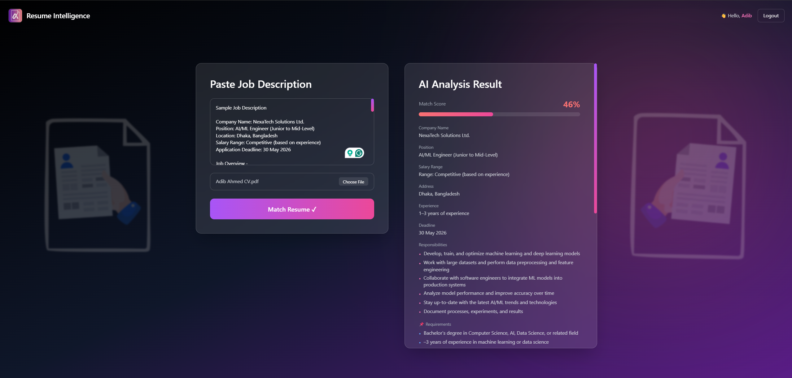
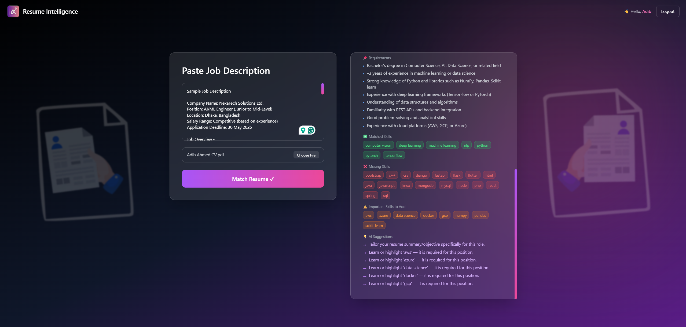

<div align="center">



# 🧠 Resume Intelligence

### AI-Powered Resume Analyzer & Job Matcher

[](https://fastapi.tiangolo.com)
[](https://reactjs.org)
[](https://python.org)
[](https://tailwindcss.com)

> **⚠️ Prototype** — Active development in progress. Feedback is welcome!

</div>

---

## Features

- **JWT Authentication** — Secure signup & login with bcrypt password hashing
- **Resume Parsing** — Extracts name, email, and skills from PDF resumes using pdfplumber + spaCy
- **AI Job Matching** — Semantically matches your resume skills against any job description
- **Resume Scoring** — Scores your resume out of 100 with detailed feedback
- **AI Suggestions** — Tells you exactly which skills to add for a specific role
- **Glassmorphism UI** — Dark, modern interface with smooth animations

---

## Screenshots

| Landing Page | App — Matcher |
|---|---|
|  |  |

| Login | Signup |
|---|---|
|  |  |

| Results — Top | Results — Skills |
|---|---|
|  |  |

---

## Tech Stack

### Frontend
| Technology | Purpose |
|---|---|
| React 18 | UI Framework |
| Tailwind CSS | Styling |
| React Router v6 | Client-side routing |
| Axios | HTTP requests |

### Backend
| Technology | Purpose |
|---|---|
| FastAPI | REST API framework |
| Python 3.10+ | Backend language |
| pdfplumber | PDF text extraction |
| spaCy (en_core_web_sm) | NLP / Name extraction |
| bcrypt | Password hashing |
| JWT (PyJWT) | Token-based authentication |
| SQLite | User database |
| sentence-transformers | Semantic skill matching |

---

## Run Locally

### Prerequisites
- Python 3.10+
- Node.js 18+

### Backend
```bash
cd ai-resume-analyzer
python -m venv venv
venv\Scripts\activate        # Windows
# source venv/bin/activate   # Mac/Linux

pip install -r requirements.txt
python -m spacy download en_core_web_sm

uvicorn app.main:app --reload
# Runs on http://127.0.0.1:8000
```

### Frontend
```bash
cd resume-ui
npm install
npm start
# Runs on http://localhost:3000
```

---

## 📁 Project Structure

```
resume-intelligence/
├── ai-resume-analyzer/        # FastAPI Backend
│   ├── app/
│   │   ├── main.py            # API routes
│   │   ├── auth.py            # JWT + bcrypt auth
│   │   ├── database.py        # SQLite helpers
│   │   ├── parser.py          # PDF parsing + skill extraction
│   │   ├── scorer.py          # Resume scoring logic
│   │   └── semantic_matcher.py# AI job matching
│   ├── uploads/               # Uploaded resumes
│   ├── requirements.txt
│   └── users.db               # SQLite database
│
├── resume-ui/                 # React Frontend
│   ├── src/
│   │   ├── pages/
│   │   │   ├── LandingPage.js
│   │   │   ├── LoginPage.js
│   │   │   ├── SignupPage.js
│   │   │   └── AppPage.js
│   │   ├── App.js
│   │   └── index.css
│   └── public/
│
└── screenshots/               # App screenshots
```

---

## Roadmap

- [ ] Google & Facebook OAuth
- [ ] Resume PDF export with suggestions applied
- [ ] Cloud deployment (Render + Vercel)
- [ ] Resume history per user
- [ ] Cover letter generator

---

## Author

**Adib Ahmed**
- LinkedIn: [https://www.linkedin.com/in/adib191/]
- GitHub: [https://github.com/Adib5947]

---

<div align="center">
  <sub>⭐ Star this repo if you found it useful!</sub>
</div>
